

<picture><source media="(max-width: 767px)" srcset="https://raw.githubusercontent.com/Aayushvz/Aayushvz/main/assets/m/header.svg"></picture>

 

<picture><source media="(max-width: 767px)" srcset="https://raw.githubusercontent.com/Aayushvz/Aayushvz/main/assets/m/tagline.svg">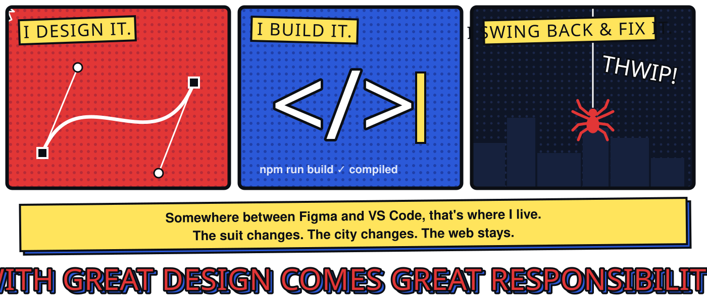</picture>

<picture><source media="(max-width: 767px)" srcset="https://raw.githubusercontent.com/Aayushvz/Aayushvz/main/assets/m/web-divider.svg"></picture>

##  Roles

<a href="https://aayushvisuals.com"><picture><source media="(max-width: 767px)" srcset="https://raw.githubusercontent.com/Aayushvz/Aayushvz/main/assets/m/hero-profile.svg"></picture></a>

<a href="https://aayushvisuals.com"><picture><source media="(max-width: 767px)" srcset="https://raw.githubusercontent.com/Aayushvz/Aayushvz/main/assets/m/portfolio-cta.svg"></picture></a>

<picture><source media="(max-width: 767px)" srcset="https://raw.githubusercontent.com/Aayushvz/Aayushvz/main/assets/m/suit-divider.svg">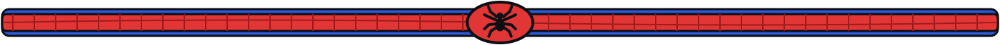</picture>

##  My Tech Stack

<picture><source media="(max-width: 767px)" srcset="https://raw.githubusercontent.com/Aayushvz/Aayushvz/main/assets/m/techstack-web.svg"></picture>

<picture><source media="(max-width: 767px)" srcset="https://raw.githubusercontent.com/Aayushvz/Aayushvz/main/assets/m/web-divider.svg"></picture>

##  Projects

  <a href="https://github.com/Aayushvz/cat-operator-assistant"><picture><source media="(max-width: 767px)" srcset="https://raw.githubusercontent.com/Aayushvz/Aayushvz/main/assets/m/projects/cat.svg"></picture></a>
  <a href="https://github.com/Aayushvz/Aayush-Visuals-Website"><picture><source media="(max-width: 767px)" srcset="https://raw.githubusercontent.com/Aayushvz/Aayushvz/main/assets/m/projects/visuals.svg"></picture></a>

  <a href="https://aayushvisuals.com/work/cpgrams"><picture><source media="(max-width: 767px)" srcset="https://raw.githubusercontent.com/Aayushvz/Aayushvz/main/assets/m/projects/cpgrams.svg"></picture></a>
  <a href="https://github.com/Aayushvz/invoice-generator"><picture><source media="(max-width: 767px)" srcset="https://raw.githubusercontent.com/Aayushvz/Aayushvz/main/assets/m/projects/invoice.svg"></picture></a>

  <a href="https://aayushvisuals.com/contract"><picture><source media="(max-width: 767px)" srcset="https://raw.githubusercontent.com/Aayushvz/Aayushvz/main/assets/m/projects/contract.svg"></picture></a>
  <a href="https://github.com/Aayushvz/Course-finder-bot"><picture><source media="(max-width: 767px)" srcset="https://raw.githubusercontent.com/Aayushvz/Aayushvz/main/assets/m/projects/coursebot.svg"></picture></a>

<picture><source media="(max-width: 767px)" srcset="https://raw.githubusercontent.com/Aayushvz/Aayushvz/main/assets/m/suit-divider.svg"></picture>

##  Contribution Graph

<picture><source media="(max-width: 767px)" srcset="https://raw.githubusercontent.com/Aayushvz/Aayushvz/output/spider-contribution-graph-mobile.svg"></picture>

<picture><source media="(max-width: 767px)" srcset="https://raw.githubusercontent.com/Aayushvz/Aayushvz/main/assets/m/web-divider.svg"></picture>

##  Find Me

<picture><source media="(max-width: 767px)" srcset="https://raw.githubusercontent.com/Aayushvz/Aayushvz/main/assets/m/spider-signal.svg"></picture>

  <a href="https://aayushvisuals.com"><picture><source media="(max-width: 767px)" srcset="https://raw.githubusercontent.com/Aayushvz/Aayushvz/main/assets/m/contact/portfolio.svg"></picture></a>
  <a href="https://linkedin.com/in/aayushvz"><picture><source media="(max-width: 767px)" srcset="https://raw.githubusercontent.com/Aayushvz/Aayushvz/main/assets/m/contact/linkedin.svg"></picture></a>
  <a href="https://instagram.com/aayush.visuals"><picture><source media="(max-width: 767px)" srcset="https://raw.githubusercontent.com/Aayushvz/Aayushvz/main/assets/m/contact/instagram.svg"></picture></a>
  <a href="mailto:aayushvisuals@gmail.com"><picture><source media="(max-width: 767px)" srcset="https://raw.githubusercontent.com/Aayushvz/Aayushvz/main/assets/m/contact/email.svg"></picture></a>

 

<picture><source media="(max-width: 767px)" srcset="https://raw.githubusercontent.com/Aayushvz/Aayushvz/main/assets/m/footer-swing.svg"></picture>

