 

> I design it, I build it, I swing back and fix what broke.
>
> Somewhere between Figma and VS Code, that's where I live.
> The suit changes. The city changes. The web stays.
>
> **With great design comes great responsibility.**

##  Roles

- Final-year B.Tech CS student, VIT Vellore (2023 to 2027)
- Product designer and design engineer, building [aayushvisuals.com](https://aayushvisuals.com)
- Freelance creative since 2020: branding, UI/UX, motion and video

##  My Tech Stack

##  Projects

  
  

  
  

  
  

##  Contribution Graph

<picture>
  <source media="(prefers-color-scheme: dark)" srcset="https://raw.githubusercontent.com/Aayushvz/Aayushvz/output/spider-contribution-graph-dark.svg">
  <source media="(prefers-color-scheme: light)" srcset="https://raw.githubusercontent.com/Aayushvz/Aayushvz/output/spider-contribution-graph.svg">
  
</picture>

##  Find Me

 

